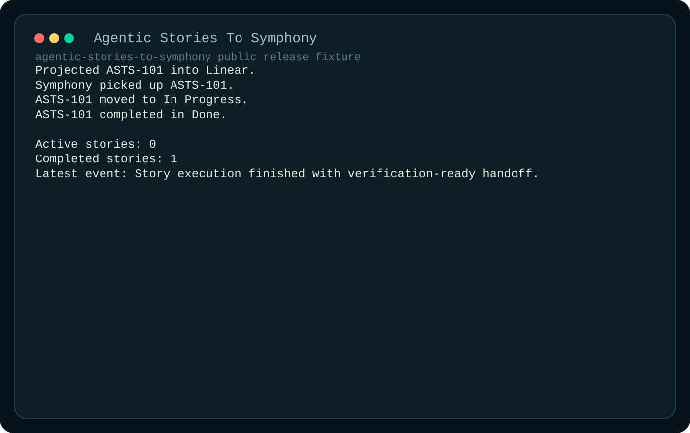

# Agentic Stories To Symphony

TypeScript fork of Symphony that adds a spec-first intake and planning layer ahead of execution. The point of this repo is simple: product intent should not jump straight into implementation. It should be captured, approved, projected into executable Linear stories, and then handed to Symphony so those stories can be developed agentically with an explicit audit trail.

## Why We Built It

The base Symphony repo is strong at execution orchestration, verification gates, and run-state observability. What it did not own was the front of the workflow: turning ambiguous product intent into an approved, canonical plan before execution starts.

This fork exists to close that gap.

We built it to prove a tighter delivery loop:

`conversation -> canonical spec -> Linear user stories -> Symphony execution`

That gives us:

- a durable source of product truth before tickets are created
- explicit approval before work hits the tracker
- deterministic Linear projection instead of ad hoc story creation
- a clearer handoff into agentic development, where Symphony works the projected stories rather than inventing them on the fly

## Why This Is A Symphony Fork

Symphony remains the execution foundation. This repo does not replace Symphony's core value proposition. It extends it.

The fork adds:

- guided terminal intake for product requirements
- repo-local spec compilation and revision storage
- approval gating before tracker writeback
- Linear story projection with provenance
- a handoff contract that makes those projected stories ready for Symphony to execute agentically

The result is a broader product surface: not just "run stories safely," but "decide what the stories are, approve them, and then run them safely."

## What The Fork Adds

### 1. Spec-first intake

Operators move through a terminal workflow that captures:

- product outcome
- intended users
- core workflow
- must-have features
- out-of-scope boundaries
- constraints

The output is a canonical spec revision stored in-repo.

### 2. Approval before projection

Nothing goes to Linear until an allowed approver confirms the revision. That keeps planning intent explicit and auditable.

### 3. Deterministic Linear projection

Approved requirements are compiled into user stories and projected into Linear with stable provenance metadata and idempotent rerun behavior.

### 4. Agentic story development through Symphony

Once the stories exist, Symphony becomes the execution path. In other words, this fork is the system that gets the right user stories ready to be developed agentically.

## Architecture And Workflow

The current public slice is intentionally narrow and explicit:

1. Run terminal intake.
2. Review the compiled planning summary.
3. Approve the revision.
4. Project stories into Linear.
5. Hand those stories to Symphony-compatible execution.

Key design rules:

- the repo-local spec is the source of truth
- Linear is the operational board, not the product spec
- approvals are explicit
- projection should be deterministic and replay-safe
- Symphony remains issue-centric on the execution side

Supporting docs:

- [User Guide](./docs/USER_GUIDE.md)
- [Architecture](./ARCHITECTURE.md)
- [Plans Index](./docs/PLANS.md)

## Screenshots

The screenshots below are generated from fixture data with `npm run artifacts:public`. They are sanitized for public release and do not use live workspace identifiers.

### Intake prompts


### Review summary


### Linear projection


### Execution watch



## Setup

Requirements:

- Node.js 20+
- a Linear API key
- a local `WORKFLOW.md` copied from [`WORKFLOW.example.md`](./WORKFLOW.example.md)

Quick start:

```bash
npm ci
cp WORKFLOW.example.md WORKFLOW.md
export LINEAR_API_KEY="replace-with-your-linear-api-key"
npm run intake -- --approve-as demo-reviewer
```

PowerShell:

```powershell
Copy-Item WORKFLOW.example.md WORKFLOW.md
$env:LINEAR_API_KEY="replace-with-your-linear-api-key"
npm run intake -- --approve-as demo-reviewer
```

Useful commands:

- `npm test`
- `npm run build`
- `npm run artifacts:public`

If you need the legacy fallback path, copy [`harness.config.example.json`](./harness.config.example.json) to `harness.config.json` and set `LINEAR_API_KEY` in your shell.

## Current Limitations

- The current handoff path proves Symphony compatibility; it does not yet replace Symphony with a native end-to-end runtime in this repo.
- Direct Symphony pickup is still inferred through the watch flow rather than a first-class native execution signal.
- The public release is sanitized and fixture-driven; it does not ship live workspace artifacts.

## Roadmap

- deepen the planning hierarchy from flat must-have features into richer story decomposition
- make `WORKFLOW.md` the only runtime config path after the compatibility bridge is no longer needed
- strengthen direct Symphony pickup and writeback observation
- extend public docs and examples around multi-story execution and review flows

## License

This repo carries the same Apache 2.0 license text as the Symphony base used for this forked implementation.
