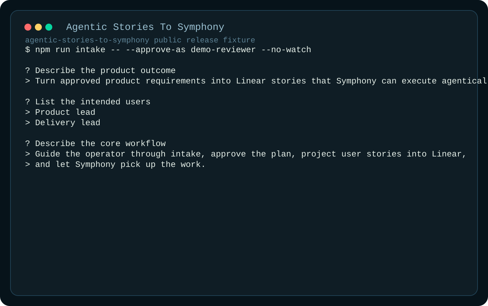
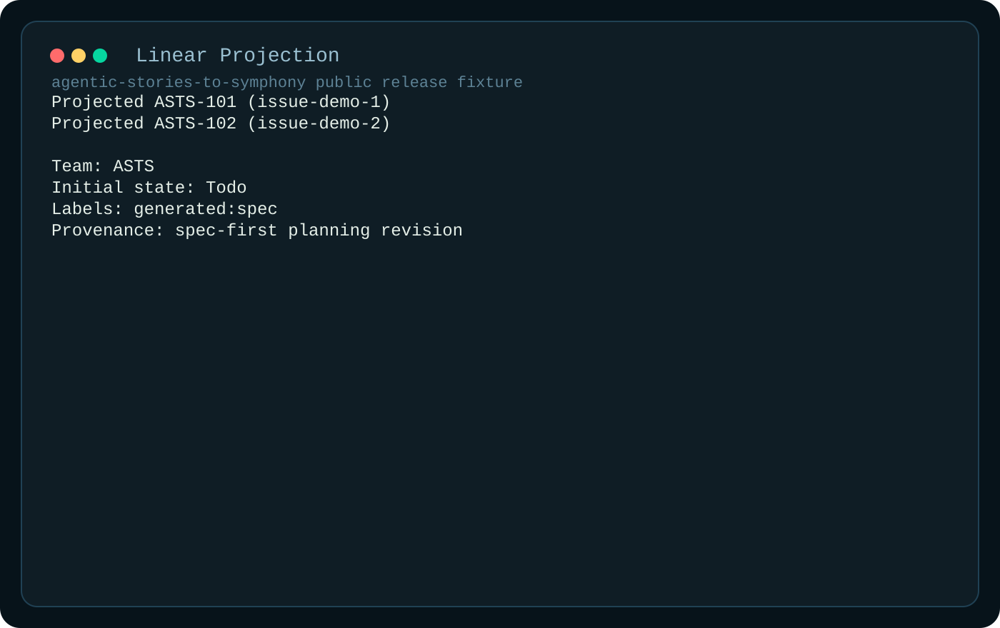

# Agentic Stories To Symphony

Spec-first planning fork layered onto Symphony execution. This repo captures product intent, compiles canonical spec revisions, gates approval, projects deterministic Linear stories, and then hands those stories into Symphony-style agentic execution.




See [docs/landing.md](docs/landing.md) for the full landing walkthrough.

## Why This Exists

Base Symphony orchestration is strong at execution runtime behavior. This fork adds the planning front-end that many teams skip: intake, approval, and deterministic story projection before the runtime starts.

## Fork Framing

This is an implementation fork that extends Symphony workflow patterns. It does not claim upstream authorship of the Symphony model. The added value in this repo is the planning-to-execution contract and the evidence trail that supports it.

## What It Adds

- guided intake for requirements capture
- canonical in-repo spec revisions
- approval gate before tracker writeback
- deterministic Linear story projection with provenance
- execution watch flow for agentic handoff

## Quick Start

Requirements:

- Node.js 20+
- Linear API key
- local `WORKFLOW.md` copied from `WORKFLOW.example.md`

```bash
npm ci
cp WORKFLOW.example.md WORKFLOW.md
export LINEAR_API_KEY="replace-with-your-linear-api-key"
npm run intake -- --approve-as demo-reviewer
```

PowerShell:

```powershell
Copy-Item WORKFLOW.example.md WORKFLOW.md
$env:LINEAR_API_KEY="replace-with-your-linear-api-key"
npm run intake -- --approve-as demo-reviewer
```

## Verification

- `npm test`
- `npm run build`
- `npm run artifacts:public`

## Public Safety Notes

- no live credentials are tracked in-repo
- artifacts under `artifacts/public-release` are sanitized fixture outputs
- workflow and tracker behavior is documented for auditable review

See [docs/landing.md](docs/landing.md), [ARCHITECTURE.md](ARCHITECTURE.md), and [docs/PLANS.md](docs/PLANS.md).
