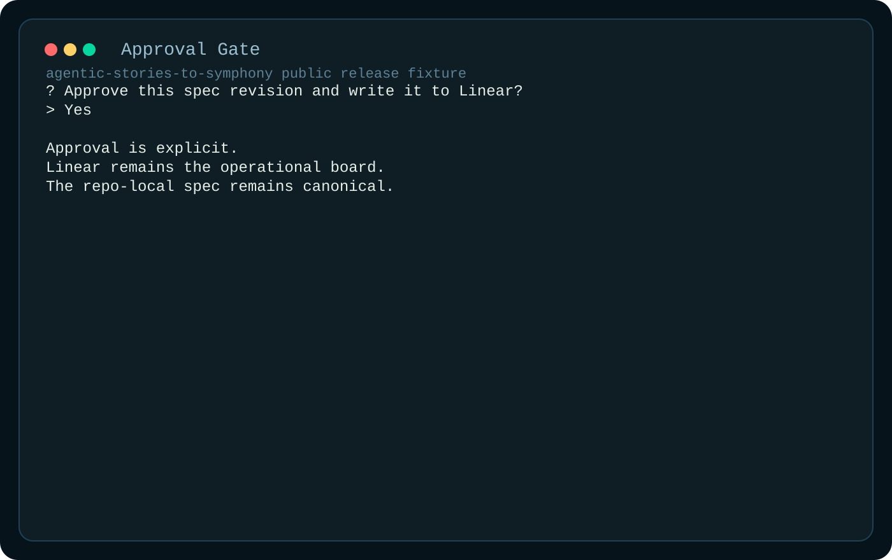
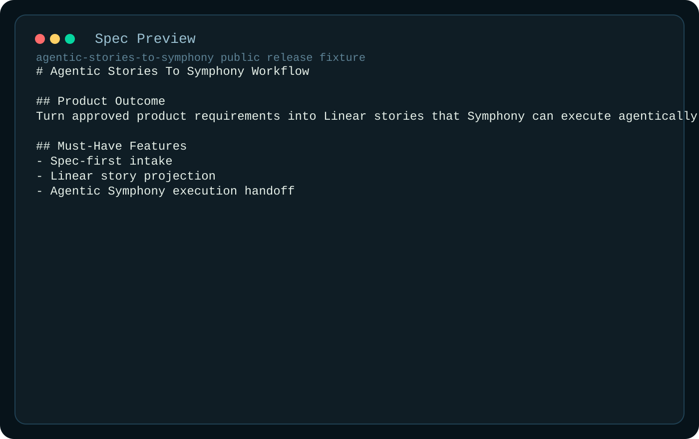

# Agentic Stories To Symphony User Guide

**Status:** Public release draft  
**Last Updated:** 2026-03-09

This guide explains the current public workflow: capture requirements, approve them, project them into Linear, and hand the resulting stories to Symphony for agentic execution.

All screenshots in this guide come from the sanitized fixture pipeline in [`artifacts/public-release/`](../artifacts/public-release/). Refresh them with `npm run artifacts:public`.

## What This Workflow Does

The current terminal flow is designed for one operator moving a product request into execution-ready stories:

1. Capture the product outcome and scope.
2. Compile that intake into a canonical spec revision.
3. Require explicit approval before tracker writeback.
4. Project user stories into Linear.
5. Expose a Symphony-compatible handoff and watch path.

## Runtime Configuration

`WORKFLOW.md` is the primary runtime contract. `harness.config.json` still works as a compatibility fallback, but public setup should use `WORKFLOW.example.md`.

Minimum public setup:

1. Copy [`WORKFLOW.example.md`](../WORKFLOW.example.md) to `WORKFLOW.md`.
2. Set `LINEAR_API_KEY` in your shell using [`.env.example`](../.env.example) as the value template.
3. Install dependencies with `npm ci`.

Example:

```powershell
Copy-Item WORKFLOW.example.md WORKFLOW.md
$env:LINEAR_API_KEY="replace-with-your-linear-api-key"
npm run intake -- --approve-as demo-reviewer
```

Useful flags:

- `--approve-as <name>` to pre-fill the approver
- `--session <id>` to resume a saved session
- `--no-watch` to stop after projection

## Walkthrough

### 1. Intake prompts

The operator is guided through product outcome, users, workflow, must-have features, out-of-scope items, and constraints.


### 2. Review summary

Before approval, the CLI renders a compact summary of what will become the canonical spec revision.


### 3. Approval gate

Projection is blocked until an approved operator confirms the revision.



### 4. Spec preview

After approval, the generated spec is rendered in markdown form and written under `specs/` in the operator's local workspace.



### 5. Linear projection

Approved stories are projected into the configured Linear team with deterministic provenance.


### 6. Execution watch

The current watch flow shows when Symphony-compatible execution picks up a projected story and moves it toward completion.


## Public Release Notes

- The screenshots and transcript are fixture-generated and sanitized.
- The public docs intentionally avoid live team keys, issue IDs, workstation paths, and local smoke artifacts.
- This repo is positioned as a Symphony-derived planning and handoff layer, not as a claim that the full Symphony runtime has already been replaced here.

## Troubleshooting

### Missing runtime config

If startup fails for missing config:

- create `WORKFLOW.md` from `WORKFLOW.example.md`
- or create `harness.config.json` from `harness.config.example.json` only if you are intentionally testing the fallback path

### Missing API key

If the CLI fails before projection:

- inspect `linear.apiKeyEnvVar` in `WORKFLOW.md`
- set that environment variable before rerunning intake

### Unauthorized approver

If approval fails:

- add the operator to `approverAllowlist` in `WORKFLOW.md`
- rerun with `--approve-as <allowed-name>`
