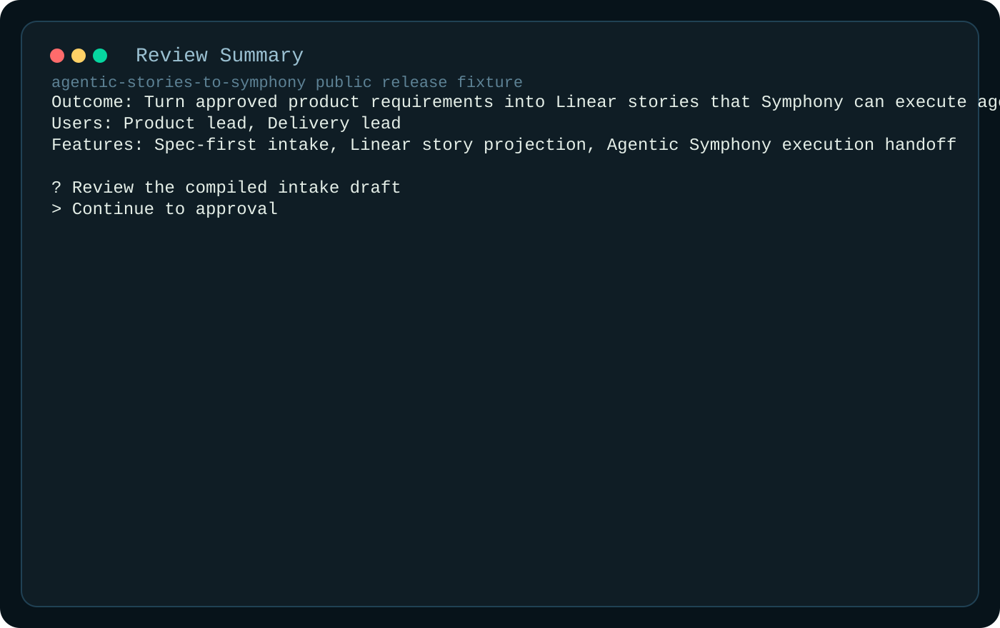

# Agentic Stories To Symphony Landing

## What This Is

`agentic-stories-to-symphony` is a planning-first fork that turns ambiguous product input into approved, canonical spec revisions and deterministic Linear stories before execution begins.

## Who It Is For

This repo is for reviewers who care about system quality before runtime: intake quality, approval controls, and reliable planning-to-execution handoff.

## Why This Exists

Execution orchestration without planning discipline creates noisy trackers and low-trust automation. This fork exists to close that gap by making story creation explicit, auditable, and replay-safe.

## Screenshot Walkthrough

Intake prompts show the structured requirements capture step.

Review summary shows the canonical spec revision before approval.

Projection output shows deterministic story generation with provenance.

## Quick Evaluation

1. Read [README.md](../README.md) for the short flow.
2. Review [ARCHITECTURE.md](../ARCHITECTURE.md) for runtime wiring.
3. Inspect `src/` and `specs/` for intake/projection behavior.
4. Read [docs/PLANS.md](PLANS.md) for implementation context.

## Repo Signals

- explicit fork/contribution framing
- public-safe fixture-based artifacts
- deterministic planning-to-tracker design
- direct tie-in to Symphony execution posture
